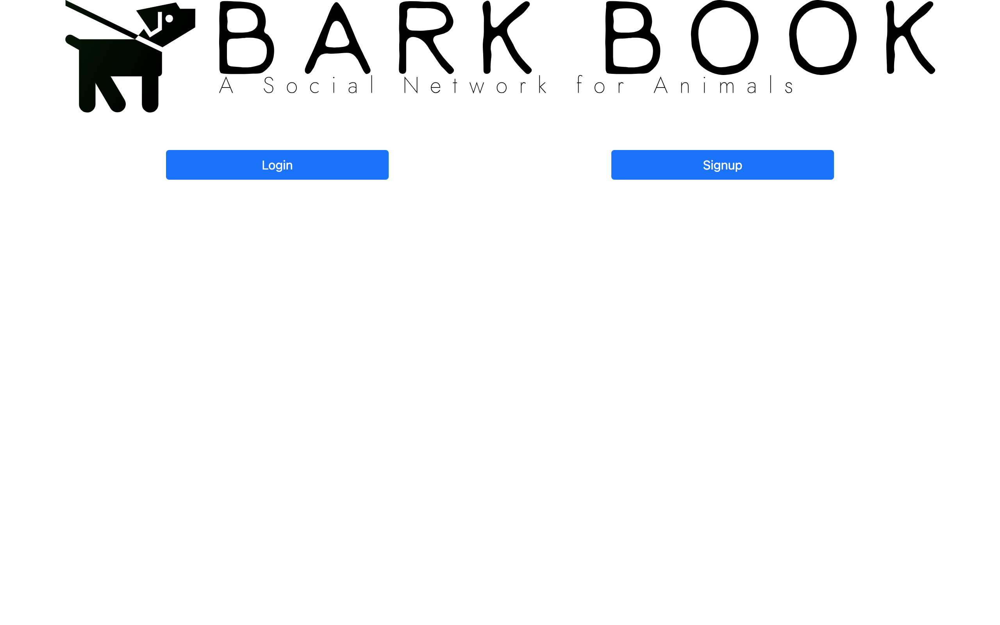
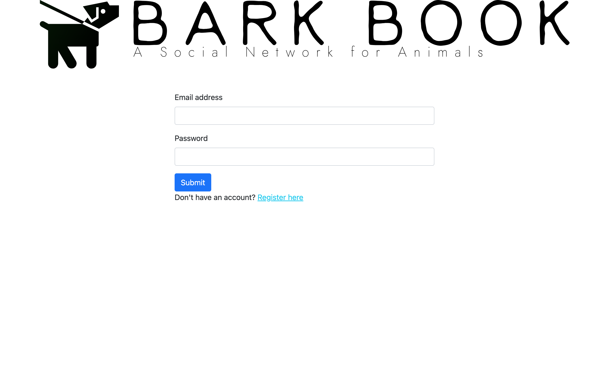
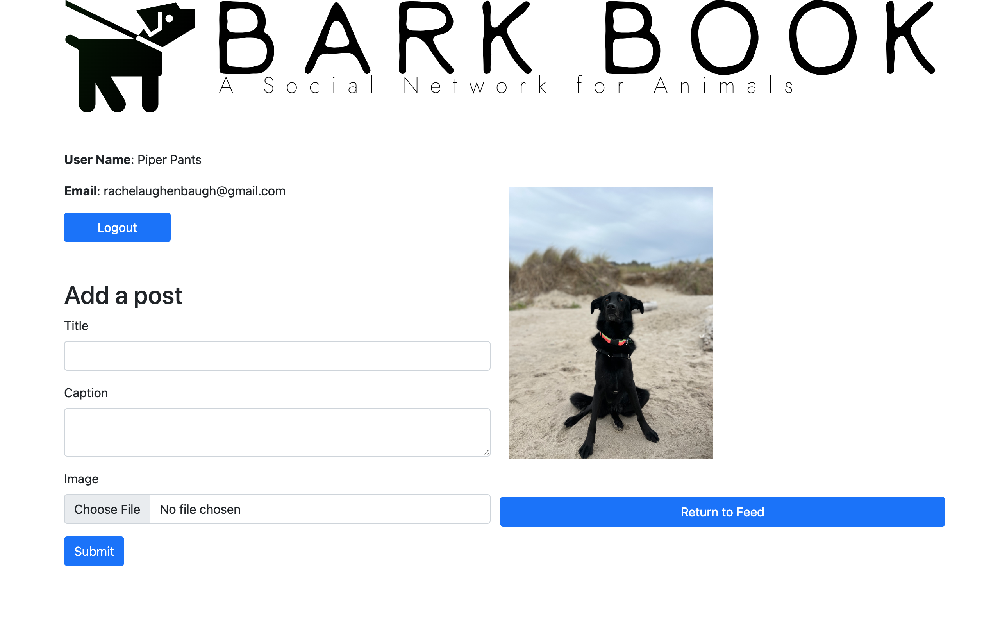

# Bark Book
Bark Book is a full stack social networking app for your pets! 

**Link to project:** not hosted at this time

## How It's Made:

**Tech used:** CSS, JavaScript, Node.js

**Dependencies used:** bcrypt, cloudinary, connect-mongo, dotenv, ejs, express, express-flash, express-session, method-overide, mongodb, mongoose, morgan, multer, nodemon, passport, passport-local, validator

Users can login to their profile and post pictures of their animals. Likes and comments can be make on individual posts. EJS is used for templating, schemas are created using Mongoose, and Passport is used for authentication.

## Functionality to Add:

- add user names to comments
- add user names to captions
- add likes to comments

## Lessons Learned:

EJS completely reloads with every refresh. With an app that adds a lot of comments like this one, it may be good to use React or something that breaks the code down into components so refresh isn't on everything. 
